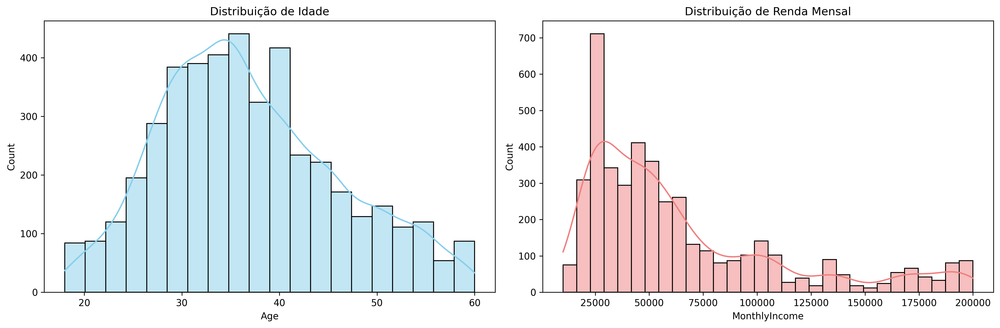
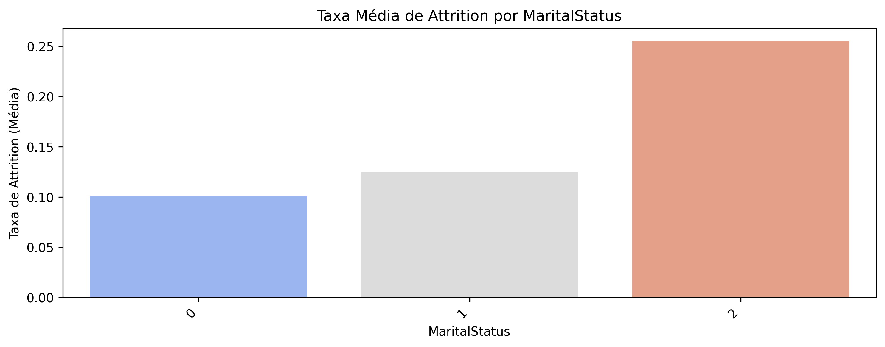
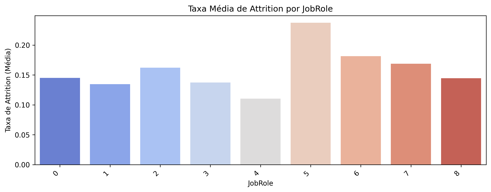
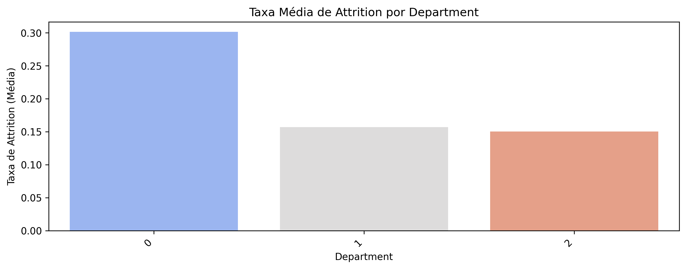
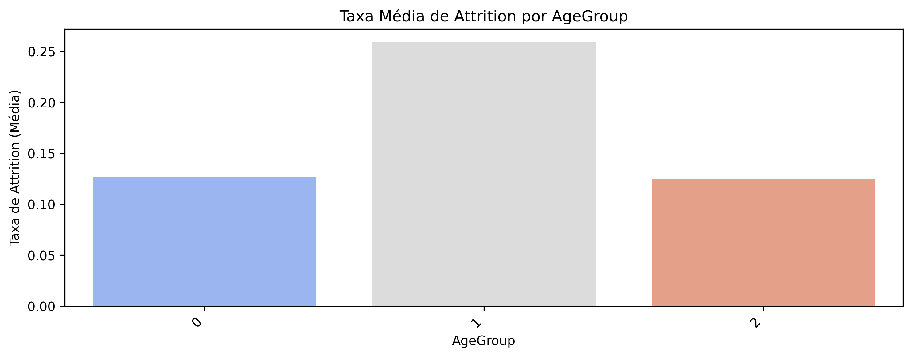

🟪 2.2 Fazer uma análise exploratória

Nesta etapa, realizamos uma **análise exploratória completa do dataset**, Apos tratamento de valores ausentes, criação de variáveis categóricas derivadas e uma avaliação estatística das principais variáveis. A variável-alvo (Attrition) apresenta uma proporção de 16,12% de desligamento voluntário.

### 🟣 2.2.1 Agrupar dados de acordo com variáveis ​​categóricas

Foram analisadas variáveis categóricas com base na **taxa média de rotatividade** (`Attrition = 1`), permitindo identificar perfis com maior risco de saída da empresa.

### 🔹 Taxa de Rotatividade por Departamento

| Departamento (Código) | Taxa de Rotatividade Média |
|:---------------------:|:---------------------------:|
| 0                     | 30,16%                      |
| 1                     | 15,71%                      |
| 2                     | 15,02%                      |

> 📌 **Insight Crítico:** O **Departamento 0** apresenta a maior taxa de rotatividade, o que pode indicar desafios específicos relacionados à área.

### 🔹 Taxa de Rotatividade por Faixa Etária (AgeGroup)

| Faixa Etária (Código) | Faixa Etária      | Taxa de Rotatividade |
|:---------------------:|:-----------------:|:---------------------:|
| 1                     | Adulto (31–45)    | 25,91%                |
| 0                     | Jovem (<31)       | 12,70%                |
| 2                     | Sênior (>45)      | 12,45%                |

> 🔍 **Insight:** Profissionais entre **31 e 45 anos** apresentam maior tendência de desligamento voluntário.

### 🔹 Outros Fatores de Risco Elevado

| Variável       | Categoria (Código) | Taxa de Rotatividade Média |
|----------------|--------------------|-----------------------------|
| MaritalStatus  | 2 (Divorciado(a))  | 25,53%                      |
| Gender         | 1 (Feminino)       | 16,67%                      |
| JobRole        | 5                  | 23,75%                      |

### 🟣 2.2.2 Visualizar as variáveis categóricas

Gráficos de barras foram gerados para ilustrar as taxas médias de `Attrition` por categoria de cada variável. As imagens estão salvas na pasta `/figuras` do repositório.

### 📊 Distribuição de Idade e Renda

### 🚻 Rotatividade por Gênero

### 💍 Rotatividade por Estado Civil

### 💼 Rotatividade por Cargo

### 🏢 Rotatividade por Departamento

### 📈 Rotatividade por Faixa Etária

### 🟣 2.2.3 Aplicar medidas de tendência central

Foi calculada a **média** e a **mediana** das principais variáveis numéricas para entender os valores típicos do conjunto de dados:

| Variável            | Média          | Mediana (50%)   |
|---------------------|----------------|------------------|
| Age                 | 36,92          | 36,0             |
| MonthlyIncome       | R$ 65.029,31    | R$ 49.190,00      |
| TotalWorkingYears   | 11,28 anos      | 10,0 anos         |
| YearsAtCompany      | 7,01 anos       | 5,0 anos          |

> 💡 **Destaque:** A diferença entre média e mediana da renda mensal indica uma **distribuição assimétrica à direita**, influenciada por salários elevados.

### 🟣 2.2.4 Visualizar distribuição

A forma das distribuições foi analisada com base em histogramas:

- **Age (Idade):** distribuição razoavelmente simétrica, com concentração entre 30 e 45 anos.  
- **MonthlyIncome (Renda Mensal):** claramente assimétrica à direita, reforçando o impacto de salários altos sobre a média.

### 🟣 2.2.5 Aplicar medidas de dispersão 

As **medidas de dispersão** complementam a análise descritiva, fornecendo uma ideia da variação dos dados:

| Variável             | Desvio Padrão | Mínimo   | Máximo    |
|----------------------|---------------|----------|-----------|
| Age                  | 9,13          | 18       | 60        |
| MonthlyIncome        | R$ 47.068,89  | R$ 10.090 | R$ 199.990 |
| TotalWorkingYears    | 7,77          | 0        | 40        |
| NumCompaniesWorked   | 2,49          | 0        | 9         |

> ⚠️ **Observação:** A alta dispersão salarial evidencia **grande desigualdade de renda**, o que pode ser um fator de insatisfação e contribuir para a rotatividade.
